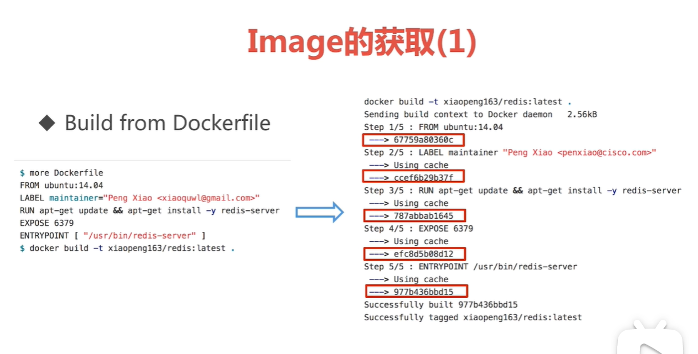
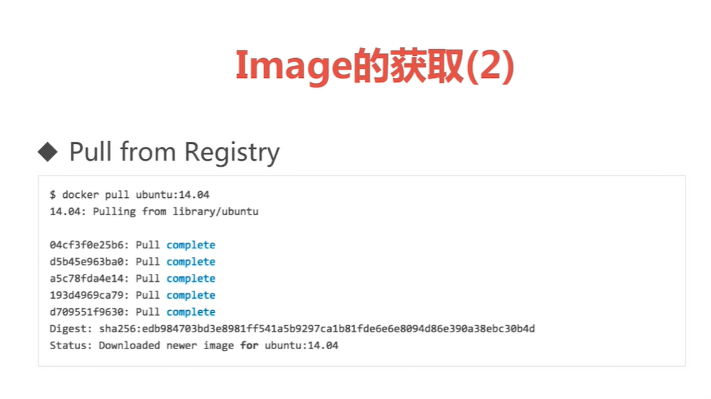
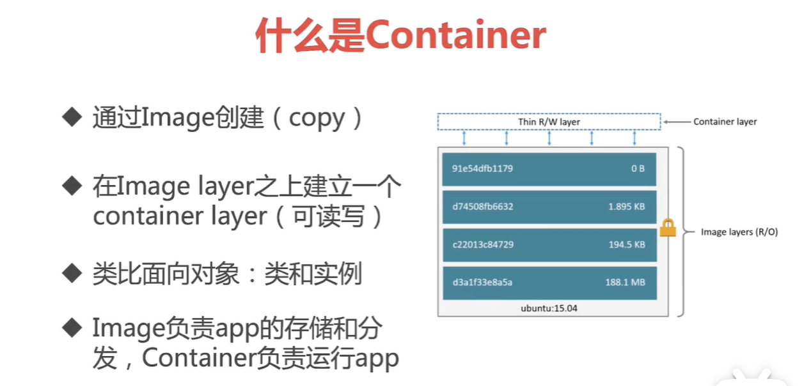

# Docker教程

链接：https://www.bilibili.com/video/BV1UZ4y1h7Wg?spm_id_from=333.337.search-card.all.click

## 第一章 容器技术和Docker简介

## 第二章 Docker环境的各种搭建方法

## 第三章 Docker的镜像和容器

### 3.1 Docker的架构和底层技术

### 3.2 Docker Image概述

#### 3.2.1 Image获取

### 3.3 什么是Container

#### 3.3.1 container命令

1、批量删除容器：

docker rm $(docker container ls -aq)  #删除所有container

docker rm $(docker container ls -f "status=exited" -q)   #删除所有status=exited的container

2、提交容器为image

docker container commit / docker commit

步骤：

​	（1） 使用docker run -it +镜像名称  交互式进行容器修改，并退出。

​	（2）docker commit [OPTIONS] CONTAINER_ID [REPOSITORY[:TAG]]

​		其中：OPTIONS： 

​			 -a, --author=""     Author (e.g., "Your name")  

​			-m, --message=""    Commit message  

​			-p, --pause=true    Pause container during commit

3、创建image

docker image build  / docker build

步骤：

​	（1）创建Dockerfile，并进行环境设置

​	（2）当前路径下执行：docker build -t [REPOSITORY[:TAG]] .

## 第四章 Docker的网络

## 第五章 Docker的持久化存储和数据共享

## 第六章 Docker Compose 多容器部署

## 第七章 容器编排Docker Swarm

## 第八章 DevOps初体验——Docker Cloud和Docker企业版

## 第九章 容器编排Kubernetes

## 第十章 容器的运维和监控

## 第十一章 Docker+DevOps实战——过程和工具

